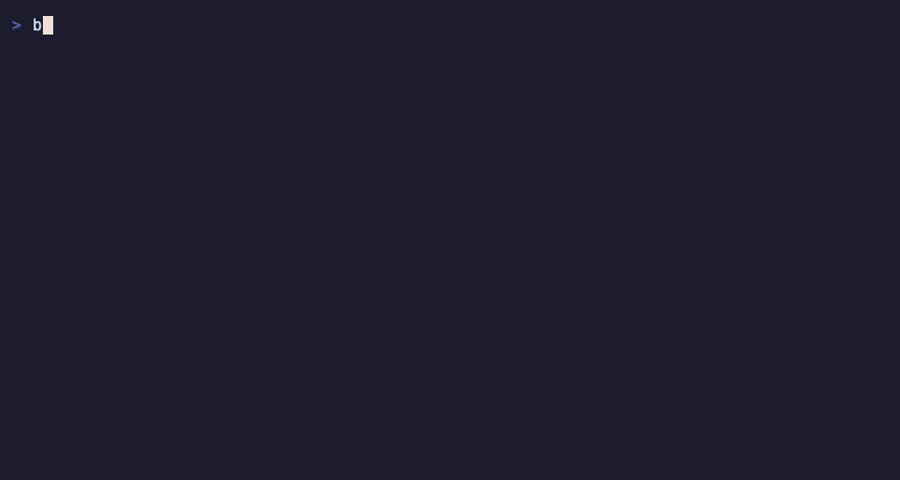

# Backfill

[](https://github.com/shyamsivakumar/backfill/releases) [](https://pypi.org/project/backfill-cli/) [](LICENSE)

Get paid while your pipelines run. A sponsored footer in your terminal during dbt runs,
cargo builds, docker builds, and other long waits — advertisers bid for the slot, you keep
half the revenue. The kickbacks.ai model applied to build wait-states, aimed at the data
stack first.



A real `dbt run` processing under `bf`: dbt's output scrolls, the sponsored line stays
pinned to the bottom row the whole run, summary and exit code intact.


The CLI is open source (MIT) on purpose: the thing running in your terminal is ~600 lines
of Go you can read in ten minutes, and it is structurally incapable of reading your code,
command output, or environment — the only fields it ever transmits are device id, ad id,
command name, and visible seconds.

What this sells that no other ad network can:

- **Command-level segments** — advertisers buy "developers currently running dbt", not
  "developers". The command name is the targeting signal; no content is ever read.
- **Verified dwell** — a footer during a 15-minute compile is continuous, verifiable
  attention. There is no tab to switch away from without abandoning the build.
- **CI earnings routing** — via the GitHub Action, a repo can point its build-log ad
  earnings at its maintainers: your CI minutes fund the dependencies you build on.

## Layout

| Dir | What |
|---|---|
| `cli/` | `bf`, a Go PTY wrapper. Runs any command, owns the terminal's last row for one ad line. |
| `web/` | Next.js app: landing, advertiser page, dashboard, ad-serve + event-ingest API, Postgres via Drizzle. |
| `action/` | GitHub Action: same model for CI logs (`uses: ./action` with `run:` input). |

## Quickstart

CLI (from source for now):

```sh
cd cli && go build -o bf . && mv bf /usr/local/bin/
bf init          # wrap dbt & friends once, so bare `dbt run` earns (installs PATH shims)
bf init --all    # or wrap every non-interactive command found on PATH
bf wrap pytest   # add any tool;  bf unwrap pytest  removes it
bf status        # device id + dashboard link
dbt run          # plain command — the footer shows, no `bf` prefix needed
```

`bf init` installs a pass-through shim per command into `~/.backfill/shims` and adds that
dir to your `PATH`. Because it is a real shim and not a shell alias, it fires wherever the
command runs — your shell, a Makefile, a script. Non-interactive runs (CI, Airflow, dbt
Cloud) detect no TTY and pass straight through with no footer, and full-screen TUIs (a
pager, `vim`, `htop`) suppress the footer automatically via the alternate-screen guard.

Agent sessions earn too. `bf agents install` wires the ad into the official status line of
**Claude Code, Codex, and Factory (`droid`)** — no patching — so the line shows while the
agent is processing:

```sh
bf agents install            # claude + codex + factory
bf agents install factory    # or one at a time
```

Claude Code users can also install via plugin: `/plugin marketplace add shyamsivakumar/backfill` then `/plugin install backfill@backfill`.

Web:

```sh
cd web && npm install
npm run dev                  # works without a database (serves house ads, events no-op)
# with Postgres:
DATABASE_URL=... npm run db:push && npm run db:seed && npm run dev
```

## How the wrapper works

`bf <cmd>` starts `<cmd>` in a PTY sized one row shorter than the real terminal, sets the
scroll region to those rows (DECSTBM), and draws a single dim `ad …` line on the reserved
bottom row, hyperlinked via OSC 8 through a click-tracking redirect. stdin is raw-mode
passthrough, SIGWINCH resizes both, exit codes are preserved. If stdout isn't a TTY or
`bf off` is set, it execs plainly with zero overhead.

It never reads your code, queries, or command output. The only telemetry is: device id,
ad id, command name (e.g. `dbt`), and visible seconds.

## Economics

- 1 impression = 5 visible seconds; advertisers buy blocks of 1,000 (CPM).
- Clicks bill at 50x an impression.
- Users keep 50% of attributable revenue; balances accrue per run, payouts planned via
  Stripe once balances cross $25.
- Until real campaigns exist, inventory is house ads with `cpm_micros = 0` — tracked but
  non-earning, shown alongside a "what this would be worth at $2 CPM" preview.

## Roadmap

- [ ] Deploy web to Vercel + Neon, point `defaultAPIBase` at <https://backfill.sh>
- [ ] Sell 2–3 flat-rate launch slots to data-tool companies
- [ ] Affiliate fill (PartnerStack/Impact): `{clickid}` SubID substitution in the click
      redirect, `/api/postback` conversion crediting, serve priority direct → affiliate → house
- [x] Agent status-line integration — `bf agents install` writes the official status line
      for Claude Code (+ `spinnerVerbs`), Codex (`tui.status_line`), and Factory
      (`statusLine`), so the ad shows while the agent is processing. No patching.
- [x] Suspend the footer when the child app enters the alternate screen (full-screen TUIs)
- [ ] JupyterLab extension (sponsored line in status bar while kernel is busy)
- [ ] Stripe Connect payouts once balances cross $25
- [ ] Real-time auction replacing flat slots
- [ ] Signed serve tokens + per-device credit gates before first paid campaign goes live
