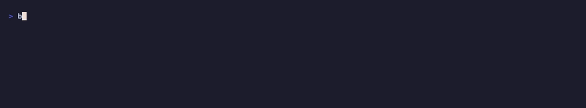

# Backfill

**Get paid while your terminal waits.** A sponsored line rides long runs: `dbt run`, `cargo build`, `docker build`, and the rest of the slow stuff. Advertisers bid for the slot, you keep half. Open source, and it never reads your code.

[](https://github.com/shyamsivakumar/backfill/releases) [](https://pypi.org/project/backfill-cli/) [](LICENSE)



*A real `dbt run` under `bf`: the per-model `START`/`OK` noise collapses into one live line that carries the ad, with the header and `PASS/WARN/ERROR` summary intact.*

## Quickstart

```sh
pip install backfill-cli   # downloads + SHA-256-verifies the bf binary on first run
bf init                    # wrap the common slow commands; your normal runs now earn
dbt run                    # runs exactly as before, with a sponsored line that pays
```

`bf init` wraps a curated set (dbt, sqlmesh, cargo, docker, terraform, npm, and more). `bf init --all` wraps every non-interactive command on your `PATH`. `bf wrap` / `bf unwrap` adjust the list, `bf uninit` removes it. The explicit `bf dbt run` always works with no setup.

## How it shows up

There are two main surfaces.

1. **Coding agents**. `bf agents install claude` sets Claude Code's thinking-spinner verb to a rotating batch. `bf agents install droid` installs a Factory droid statusLine. Codex can be launched through `bf spin codex`. The ad, a trending dev content slot, and your running `$X.XX earned` tally cycle while the agent thinks. Claude installs no status line and never touches an existing one. Claude refreshes the verb on `SessionStart` and each turn.
2. **Any other wrapped command** (dbt, sqlmesh, cargo, docker, make, `terraform plan`, npm/pnpm/yarn/bun scripts, go). The run collapses into one live line that rotates the ad, a trending repo / HN story / tip, and your $earned tally, with a spinner and an elapsed timer. That single line replaces the scrolling output in place. On a non-zero exit the captured output is flushed, so failures are never hidden. dbt and sqlmesh also show model progress counts on that line. Package installs are the plain-output exception described below.

Interactive and full-screen commands (vim, less, ssh, sudo, gh, psql and other REPLs, `terraform apply`, `docker run -it`, `npm login`) are detected and run directly in your terminal, untouched. Package-manager scaffolders such as `npm init` also keep their native terminal interaction, then get one completion ad after a successful exit. CI and non-TTY runs exec plainly with zero overhead.

## Install

Three install paths. All of them SHA-256 verify the downloaded binary.

```sh
# 1) PyPI (most common)
pip install backfill-cli

# 2) Homebrew
brew install shyamsivakumar/tap/backfill

# 3) curl installer
curl -fsSL https://backfill.sh/install.sh | sh
```

The pip wheel ships a thin Python entry point. On first run it fetches the matching `bf` release binary, verifies its SHA-256 against the published checksums, and execs it.

**macOS note.** Recent macOS (26 / "Tahoe") runs a Code Signing Monitor that silently kills an unsigned downloaded `bf` on launch, with no error to your shell. The pip and curl installers re-sign the binary ad-hoc (`codesign --sign -`) after download to clear this. If you copy a `bf` binary from somewhere else and hit it, run `codesign --force --sign - /path/to/bf` once and it works.

<details>
<summary><strong>Locked-down containers</strong> (Paradime, Codespaces, read-only base env)</summary>

When the base Python env isn't writable, `pip install` falls back to `--user` and puts `bf` in a dir that isn't on `PATH` (you'll see *"The script bf is installed in '.../.local/bin' which is not on PATH"*). That's a pip/platform thing, not a bf bug. Two ways through it:

```sh
# bootstrap without bf on PATH (self-heals PATH into your rc for next shell):
python -m backfill_cli init && exec $SHELL

# or use the explicit form, which never needs PATH:
python -m backfill_cli dbt run --select my_model
```

On **Paradime**, the durable path is `bf init`. It adds a real `export PATH="$HOME/.backfill/shims:$PATH"` to `~/.zshrc`, which the Code IDE terminal sources. Open a fresh terminal and `command -v dbt` should resolve to `~/.backfill/shims/dbt`. Avoid setting `PATH` through the Code IDE env-var UI: those values are stored literally, so a `${PATH}` reference won't expand and will clobber your shell's `PATH`.

`bf init` installs a pass-through shim per command into `~/.backfill/shims`. Because it's a real shim and not a shell alias, it fires wherever the command runs: your shell, a Makefile, a script.

</details>

## Commands

`bf` is a single MIT-licensed Go binary. The full surface:

| Command | What it does |
|---|---|
| `bf <cmd>...` | Run `<cmd>` wrapped. No setup needed. |
| `bf init [cmd...]` | One-time setup. Wraps a curated set of slow commands (dbt, sqlmesh, cargo, docker, terraform, npm, and more) by installing a PATH shim per command in `~/.backfill/shims` and prepending that dir to your shell rc. Pass extra commands to wrap more. |
| `bf init --all` | Wrap every non-interactive command on your `PATH` (skips interactive tools: editors, shells, paginators, `sudo`, `ssh`, anything that takes over the screen). |
| `bf wrap <cmd>...` | Wrap the listed commands now (adds shims). |
| `bf unwrap <cmd>...` | Remove the shims for the listed commands. |
| `bf uninit` | Remove every shim `bf init` / `bf init --all` / `bf wrap` installed, and strip the `PATH` line from your rc. |
| `bf on` / `bf off` | Globally pause or resume. `off` execs plainly with zero overhead, as if no shim is installed. |
| `bf status` | Show what's wrapped, current `on`/`off` state, and your device id and dashboard link. |
| `bf claim` | Print a one-time code and link to bind this device to your web account, so earnings show in your dashboard. |
| `bf last` | Show the last run receipt, including status, command, duration, estimated earnings, and checkpoints. |
| `bf logs last` | Print the captured log from the most recent wrapped run. |
| `bf refer` | Print a referral install command. You earn a 10% bonus from Backfill's share, not from the referred user's share. |
| `bf agents install claude` | Spinner-verb rotation for Claude Code. No status line. |
| `bf agents install droid` | Factory `droid` statusLine integration. Refuses to overwrite an existing statusLine unless you pass `--force`. |
| `bf spin codex` | Run Codex through the spinner rewriter. |
| `bf agents remove <name>` | Remove a previously installed agent integration. |
| `bf agents status` | Show which agent integrations are installed. |

`bf wrap droid` routes Factory droid through the `bf spin` rewriter without installing the Factory statusLine integration (handy for droid-specific sessions).

## How the wrapper works

`bf <cmd>` runs `<cmd>` and collapses its output into one live line. There is no pseudo-terminal on the collapsed path, no scroll region, and no reserved row.

- A wrapped non-interactive command has its stdout and stderr piped and collapsed into the one live line. On a non-zero exit the captured output is flushed, so failures are never hidden.
- Interactive and full-screen commands (vim, less, ssh, sudo, gh, psql and other REPLs, `terraform apply`, `docker run -it`, `npm login`) are detected and run directly in your terminal, untouched. Package-manager scaffolders keep native prompts and add only their success completion ad.
- Exit codes pass through end to end.
- Non-TTY execs (CI, Airflow, dbt Cloud, cron) run plainly with zero overhead: the shim detects no TTY and just `exec`s the underlying binary.

## Smart progress

For verbose commands, the per-line noise is the problem, not the wait. `bf` recognizes a set of command/verb pairs and collapses the run into one live line that carries the ad, your $earned tally, model progress, a spinner, and an elapsed timer.

| Command | Recognized verbs | What you see |
|---|---|---|
| `dbt` | `run`, `build`, `test`, `seed`, `snapshot` | One live line like `⠹ dbt 5/8 main.fct_orders · ad …`, the version header, any errors verbatim, and the final `PASS/WARN/ERROR` summary. |
| `sqlmesh` | `plan`, `run` | One live line carrying the model being applied and the ad. |

In both cases the ad rides the line your eyes are already on. The header stays, errors stay, the summary stays. Everything in between collapses.

## SQLMesh

SQLMesh is wrapped by `bf init` out of the box (or add it explicitly with `bf wrap sqlmesh`). Smart progress is active for `sqlmesh plan` and `sqlmesh run`: SQLMesh's per-model output collapses into one live line carrying the ad, the important output and the result stay, and the child exit code passes through. Same engine as the dbt smart progress.

```text
⠹ sqlmesh applying prod.my_model · ad …
```

It works from shells, Makefiles, and scripts through the PATH shim. Non-TTY and CI runs pass through plainly.

## Scaffold completion ads

After any of the following exits 0, `bf` prints one persistent sponsored line under the success screen (one impression, regardless of how long the command took):

- `npm create` / `npm init`, `pnpm create` / `pnpm init`, `yarn create` / `yarn init`, `bun create` / `bun init`
- `npx create-*`
- `cargo new`, `cargo init`
- `django-admin startproject`
- `rails new`
- `dotnet new`
- any binary named `create-*` on your `PATH` that exits 0

Package-manager scaffolders run plainly so their prompts remain usable. The other listed scaffolders use the normal collapsed route. In both cases, the line prints once under whatever success UI the scaffolder drew. These commands finish too fast for the live line to earn, but their "you're all set, here's what's next" screen is the highest-intent moment in the session.

## npm and package installs

Package installs are long waits worth monetizing. `bf init` wraps `npm`, `pnpm`, and `yarn`; add `bun` with `bf wrap bun`. Installs do not collapse: they stay attached to the terminal so the package manager's own resolving, download, and build progress remains visible.

```sh
npm install
```

After a successful install, `bf` prints one persistent sponsored completion line under the package manager's own summary. Failed installs keep their native output and do not print that line. Examples covered by this contract include `npm install` / `i` / `ci` / `update`, `pnpm add`, bare `yarn` and its install commands, `bun install`, `pip install`, and their supported install aliases. Package-manager scripts such as `npm run build`, `npm test`, `pnpm dev`, and `bun run start` still use the collapsed live line. `npm login` passes through untouched; `npm init` follows the scaffold contract above. CI and non-TTY installs pass through plainly with no completion ad.

Scaffold completions are separate (see above): after `npm create` / `npm init`, the pnpm/yarn/bun equivalents, or `npx create-*` exit 0, `bf` prints one persistent sponsored line under the "you're all set" success screen.

## Coding agents

`bf` doesn't patch any agent's source. It uses each agent's own exposed surface.

| Agent | Integration | Install |
|---|---|---|
| Claude Code | Spinner-verb rotation (no status line) | `bf agents install claude` |
| Factory (`droid`) | StatusLine integration | `bf agents install droid` |
| Codex | Spinner rewriter for the running command | `bf spin codex` |

For Factory droid spinner rewriting without a statusLine, use `bf wrap droid`. For Claude Code you can also install via the plugin marketplace: `/plugin marketplace add shyamsivakumar/backfill` then `/plugin install backfill@backfill`. `bf agents remove claude` undoes it.

## What it sells that no other ad network can

- **Command-level segments.** Advertisers buy "developers currently running dbt," not "developers." The command name is the only targeting signal. No keywords, no profiles, no behavior graph.
- **Verified dwell.** A live line during a 15-minute compile is continuous, unskippable attention. There's no tab to switch away from without abandoning the build.
- **CI earnings routing.** Via the GitHub Action, a repo points its build-log earnings at its maintainers by passing a Backfill device id. Your CI minutes fund the dependencies you build on.

## Surfaces

| Surface | What's wrapped | How |
|---|---|---|
| dbt + data stack | `dbt`, `bq`, `snowsql`, `spark-submit`, `sqlmesh` | `bf init` (curated set) or `bf wrap <cmd>` |
| Any CLI tool | `cargo`, `docker`, `make`, `terraform`, `gradle`, … | `bf init` covers these, or `bf wrap <cmd>` / `bf init --all` |
| Coding agents | Claude Code spinner verbs, Factory droid statusLine, Codex spinner rewrite | `bf agents install …` or `bf spin codex` |
| Scaffold screens | `npm create`, `cargo new`, `rails new`, … | automatic on a clean wrapped run |
| CI build logs | the GitHub Action (`action/action.yml`) | maintainer-directed earnings |

## Privacy

The CLI is structurally incapable of reading your code, command args, command output, or environment. The only fields it ever transmits:

- **device id**, a random per-install id
- **ad id**, the campaign the server chose to serve
- **command name**, the bare basename, e.g. `dbt` or `cargo`, never the path
- **visible seconds**, how long the line was actually on screen
- **event kind**, a static label, `impression` or `click`

No args, no paths, no filenames, no env, no stdout or stderr contents. The source is open under the MIT license, so you can verify.

## Economics

- **Unit:** 1 impression = 5 visible seconds.
- **Pricing:** advertisers buy blocks of 1,000 impressions (CPM). Clicks bill higher than impressions.
- **Split:** users keep 50% of attributable revenue.
- **Balances** accrue per run and surface in `bf status` and the web dashboard.
- **Payouts:** Stripe, once a balance crosses $25. Payout plumbing is planned, not live yet. Balances accrue today.
- **Early inventory:** while the first advertiser slots sell, the slot is filled with house ads at `cpm = 0`. No money changes hands, but the slot is exercised and you see a real sponsored line.

## Advertiser side

Advertisers self-serve through the portal at [backfill.sh/advertiser](https://backfill.sh/advertiser):

- Sign in with a magic link, email only, no password.
- Prepay an ad budget with a Stripe deposit.
- Submit a campaign: ad text, an https link, a CPM, and optional command targeting (e.g. only on `dbt` runs).
- Every campaign is reviewed and approved before it serves. You only pay for verified impression and click time, billed against your deposit.

### Ad selection

The hosted Backfill service gives every candidate a single unified **eCPM in micros**, then picks the max under frequency-cap and flight-window gating. The components:

- **Direct CPM**, what the advertiser pays per 1,000 impressions.
- **Affiliate expected value** = `payout × conversion-rate prior`, converted to an eCPM equivalent.
- **House floor**, the minimum to serve (currently 0 while house-ad inventory fills slots).

Bayesian shrinkage tempers noisy per-campaign conversion priors, so a campaign with 3 clicks doesn't outrank one with 3,000. A frequency cap stops a device from seeing the same ad back to back across runs, and flight windows gate serving to a campaign's scheduled dates. The hosted service code is not part of this CLI repo.

## Repo layout

| Dir | What |
|---|---|
| `cli/` | `bf`, the Go wrapper. Runs the terminal and coding-agent surfaces. |
| `action/action.yml` | GitHub Action: the same model for CI build logs, with maintainer-directed earnings. |
| `python/` | Thin Python wrapper shipped in the `backfill-cli` wheel: fetches + SHA-256-verifies the Go binary, re-signs it ad-hoc on macOS, then execs it. |

## Tests

What's covered today:

- CLI scaffold detection, including the `create-*` / `cargo new` / `npm create` allowlist and the one-line completion ad.
- CLI output rotation, spinner text, receipts, captured logs, notifications, and drain behavior.

Run the CLI tests with `go test ./...` in `cli/`.

## License

MIT
